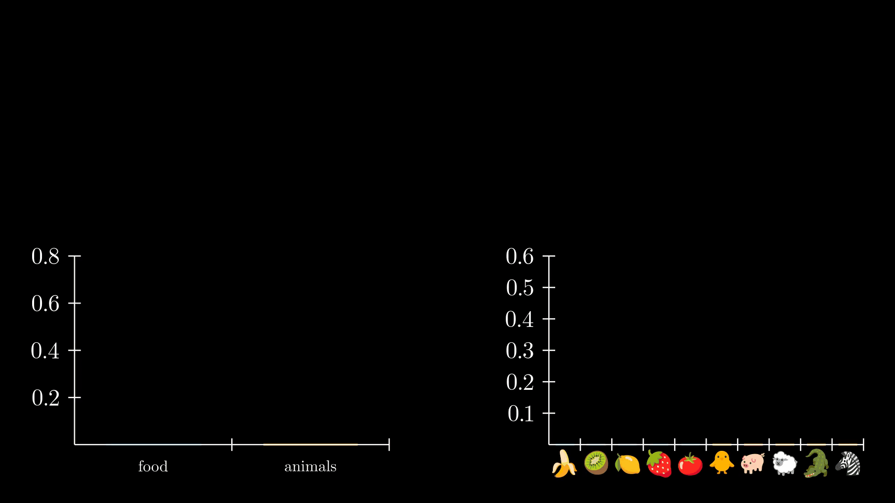
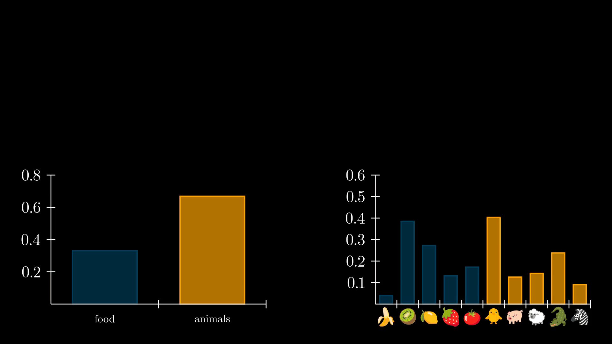
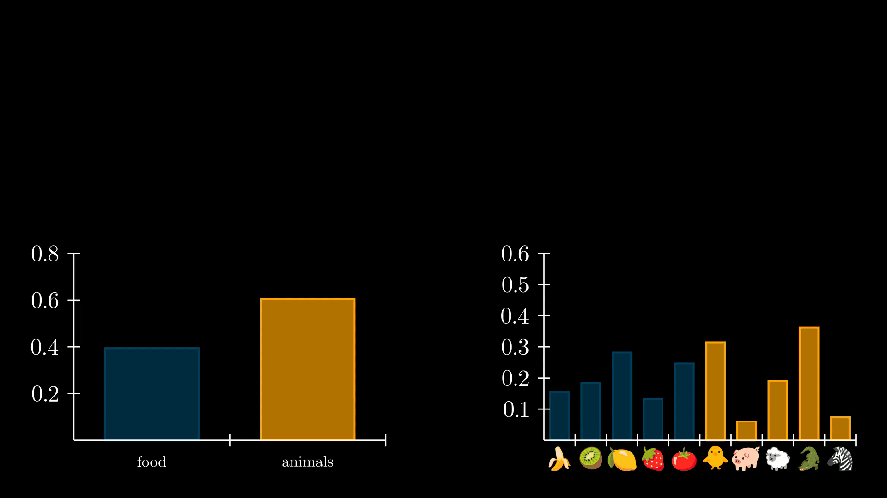
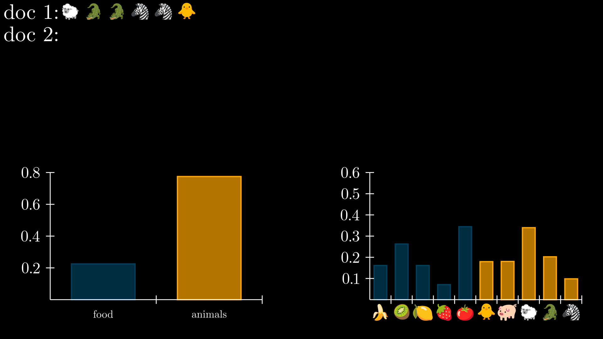
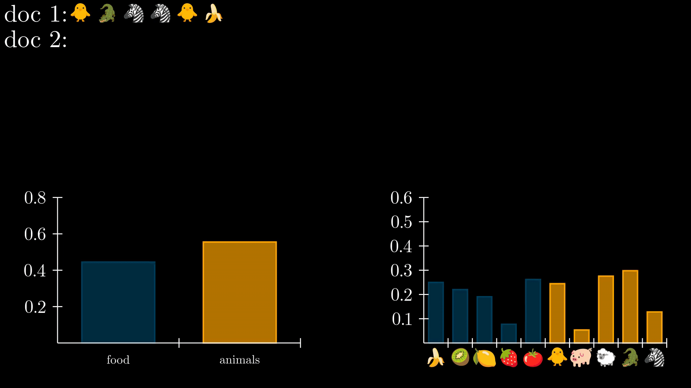

# how to recreate

run `manim topic.py` to recreate the LDA visualization. To recreate the 3B1B tutorials, you can run

```bash
manim -a 3B1B-Animated-Tutorials/3B1BCalculusLine.py
manim -a 3B1B-Animated-Tutorials/3B1BDerivParadox.py
manim -a 3B1B-Animated-Tutorials/3B1BEpsilonDelta.py
manim -a 3B1B-Animated-Tutorials/3b1bProbability.py
manim -a 3B1B-Animated-Tutorials/3B1BSpan.py
```

# LDA visualization instructions

The instructions below will guide you through the code in `topic.py` to create the following visual


Here, we will try to visualize how documents are generated by LDA. Let's assume that our vocabulary consists of the following ten words:

{🍌,🥝,🍋,🍓,🍅,🐥,🐖,🐑,🐊,🦓}

and that each document will consist of only 5 words. To visualize the generative process of LDA, we will show both the topic distribution and the word distribution per topic, in two separate `BarChart`s. The Topic distribution will be the same as what we did before

```python
BarChart(
    values=[0,0],
    bar_names=['animals', 'food'],
    y_axis_config={"font_size": 36},
    y_length=3,
    x_length=5,
    y_range=[0, 0.6, 0.1],
)
```

Unfortunately, for the word distribution, we cannot pass a list of emojis to `bar_names` and these have to be added manually one by one in the correct location. We create a helper function for this:

```python
words = [
    'banana',
    'kiwi',
    'lemon',
    'strawberry',
    'tomato',
    'chicken',
    'pig',
    'sheep',
    'crocodile',
    'zebra'
]
def add_svg_x_ticks(bar_chart):
    """
    Adds svg symbols instead of standard x-ticks to a BarChart
    """
    for i, word in enumerate(words):
        symbol = SVGMobject(f"icons/{word}.svg", width=0.4)
        symbol.next_to(bar_chart[0][i], DOWN, buff=0.3, aligned_edge=DOWN)
        bar_chart.add(symbol)
```

Here, we load an SVG symbol from disk using `symbol = SVGMobject(f"icons/{word}.svg", width=0.4)` and move it right below the corresponding bar of the `BarChart`. The `BarChart` consists of ten bars, and the "ith" bar, can be referenced with `bar_chart[0][i]`.  Using `.next_to()` we move each symbol below each respective bar. 


To illustrate the random picking of topics and words, we add two `Arrow`s to the scene

```python
arrow_topic = Line(ORIGIN, DOWN * 0.8).add_tip().set_color(BLUE)
arrow_word = Line(ORIGIN, DOWN * 0.8).add_tip().set_color(BLUE)
```

which draws a small vertical line and `.add_tip()` adds an arrowhead to it. These arrows will appear, disappear and move around to illustrate which topic and which word was picked during the random picking process. 

We start the animation by sampling from a Dirichlet distribution to obtain the topic distribution and word distribution per topic:

```python
topic_prob = dirichlet(self.alphas_topics).rvs(1)[0]
word_prob = np.concatenate(
    [
        dirichlet(self.alphas_words_topic1).rvs(1)[0],
        dirichlet(self.alphas_words_topic2).rvs(1)[0],
    ],
)
```

and initialize the animation by letting each bar transform from zero to its initial value

```python
self.play(
    histogram_topic.animate.change_bar_values(topic_prob),
    histogram_words.animate.change_bar_values(word_prob),
)
```


Next, we would like to randomly choose a topic from the topic distribution and visualize the choice using the arrow. This can be achieved by either fading them into the scene if it's the first topic/word that is chosen

```python
# move
arrow_topic.next_to(topic_distribution[0][topic], UP, buff=0.1)
arrow_word.next_to(word_distribution[0][word], UP, buff=0.1)

# animate
self.play(FadeIn(arrow_topic))
self.play(FadeIn(arrow_word))
```



or by playing a movement animation when a new topic/word is chosen

```python
# animate move
self.play(arrow_topic.animate.next_to(topic_distribution[0][topic], UP, buff=0.1))
self.play(arrow_word.animate.next_to(word_distribution[0][word], UP, buff=0.1))
```



Now that a topic and word are chosen, we start writing our document. We make a copy of the chosen word underneath the word distribution barchart and animate a movement of that word into the document that we are writing

```python
word_symbol = create_word_token(word)
word_symbol.next_to(
    word_distribution[0][word], DOWN, buff=0.3, aligned_edge=DOWN
)

topic_symbol = create_topic_symbol(row, topic)
self.play(FadeIn(topic_symbol))
self.play(word_symbol.animate.move_to(topic_symbol.get_center()))
self.play(FadeOut(topic_symbol))
```



We repeat the process of choosing a topic and word for as many times as we want the document size to be. To transition to the next document, we fadeout the arrows that we have

```python
self.play(FadeOut(arrow_topic, arrow_word))
```

and create a new row to write a new document

```python
new_row = VGroup(Tex(f"doc {doc_index}: "))
new_row.next_to(row, DOWN, buff=0.1, aligned_edge=LEFT)
self.add(new_row)
row = new_row
```



and resample the word/topic distributions

```python
topic_prob = dirichlet(self.alphas_topics).rvs(1)[0]
word_prob = np.concatenate(
    [
        dirichlet(self.alphas_words_topic1).rvs(1)[0],
        dirichlet(self.alphas_words_topic2).rvs(1)[0],
    ],
)
self.play(
    histogram_topic.animate.change_bar_values(topic_prob),
    histogram_words.animate.change_bar_values(word_prob),
)
```


and repeat the whole process for as many documents as we feel fit :)


